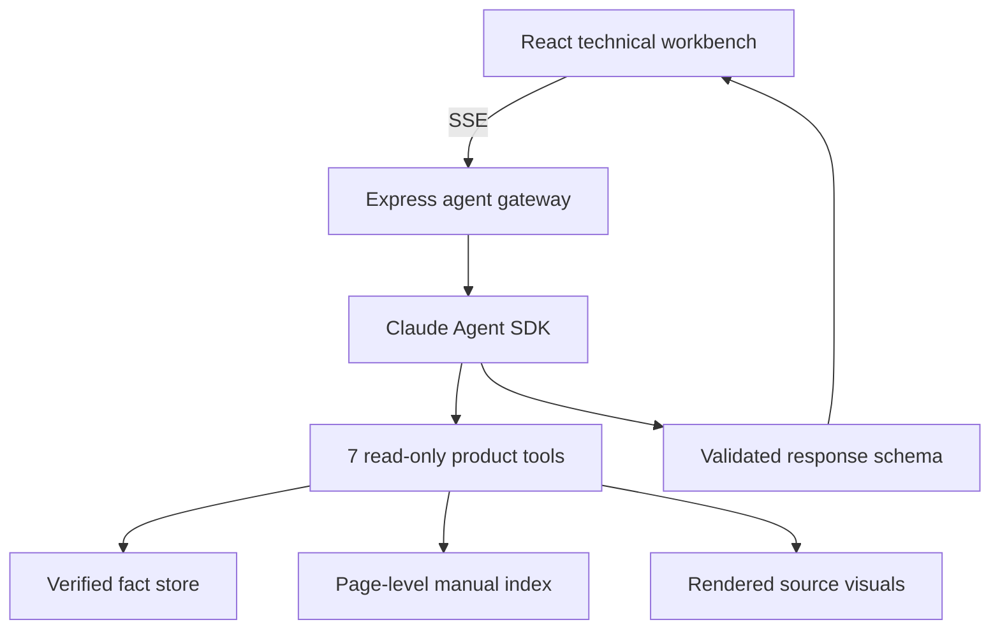

# OmniGuide

### A multimodal product specialist for the Vulcan OmniPro 220

OmniGuide turns three supplied product documents into an evidence-linked technical support experience. It answers through the Claude Agent SDK, inspects source diagrams as images, cites exact pages, and opens a purpose-built interactive artifact when text is not the clearest answer.

<p>
  
  
</p>

## Run it in under two minutes

Requirements: Node.js 20.19 or newer and one Anthropic API key.

```bash
git clone https://github.com/akshai0296/prox-challenge.git
cd prox-challenge
npm install
cp .env.example .env
# Add ANTHROPIC_API_KEY to .env
npm run dev
```

Open [http://localhost:5173](http://localhost:5173).

No key yet? The application starts in a clearly labeled deterministic demo mode. That mode covers the evaluation prompts and lets the entire UI be reviewed without spending API credits. Add a key and restart to use the live Claude Agent SDK path.

## What to try

- `What's the duty cycle for MIG welding at 200A on 240V?`
- `I'm getting porosity in my self-shielded flux-cored welds. What should I check?`
- `What polarity setup do I need for TIG? Which socket gets the ground clamp?`
- `Show me the front panel controls.`
- `Can this machine TIG-weld aluminum?`
- `What is the duty cycle at 200A on 240V?`

The last question intentionally triggers clarification because the process is missing.

## The experience

The UI is built as a compact technical workbench:

| Surface | Purpose |
| --- | --- |
| Product rail | Product scope, source inventory, runtime status, and safety context |
| Conversation | Direct answers, clarification, page citations, and follow-up prompts |
| Visual workspace | Interactive diagrams and original source evidence |

Five artifact renderers cover the product's hardest questions:

1. **Duty-cycle explorer** - switches process, input voltage, and every published amperage point; calculates weld and cooling time over the manual's 10-minute window.
2. **Polarity map** - draws both leads to the correct positive and negative sockets for MIG, flux-cored, DC TIG, and Stick.
3. **Guided troubleshooter** - turns the manual's matrices into an ordered, checkable diagnostic sequence with safety gates.
4. **Process configurator** - compares process fit by material, environment, and operator priority while preserving OmniPro-specific limitations.
5. **Manual visual viewer** - surfaces and enlarges the actual page for controls, cable setup, weld defects, duty cycle, or the wiring schematic.

## Architecture



The SDK is deliberately constrained to product-specific, in-process MCP tools. Shell, general file, network, and open-ended computer tools are not exposed to the agent.

### Agent tools

| Tool | Why it exists |
| --- | --- |
| `search_manual` | Returns ranked, page-numbered passages from the owner manual and quick-start guide |
| `lookup_duty_cycle` | Returns exact rated points and refuses interpolation |
| `lookup_polarity` | Returns verified cable, socket, polarity, gas, source page, and visual IDs |
| `troubleshoot` | Returns structured checks for seven supported failure modes |
| `compare_processes` | Returns the supplied selection matrix with product-specific limits |
| `find_manual_visual` | Finds the strongest diagram, chart, table, or diagnostic image |
| `inspect_manual_visual` | Sends the actual rendered manual page to Claude as image input |

Responses are constrained to a JSON schema, parsed with Zod, and hydrated against known artifact IDs. Invalid artifact references are dropped instead of being rendered.

## Knowledge extraction

The repository contains both reproducible raw extraction and a reviewed semantic layer:

- 48 owner-manual pages and 2 quick-start pages extracted with Poppler while retaining page boundaries
- 19 reviewed visual records for setup diagrams, controls, defect examples, troubleshooting tables, and the electrical schematic
- 24 exact duty-cycle operating points across four processes and two input voltages
- 4 process-specific polarity maps
- 7 ordered troubleshooting flows
- 4 process-selection profiles with OmniPro-specific caveats

This split is intentional. Full text makes broad retrieval possible, while reviewed facts make safety-sensitive numerical and connection questions deterministic. The model can inspect original visual evidence when extraction alone is insufficient.

Regenerate the committed text and page images with:

```bash
npm run preprocess
```

That command requires the Poppler utilities `pdftotext` and `pdftoppm`.

## Accuracy and safety decisions

- **No duty-cycle interpolation.** If an amperage is not one of the published ratings, OmniGuide shows the available points and says the exact value is not provided.
- **No guessed cable mapping.** A polarity question without a welding process receives a clarification question.
- **Product documents stay authoritative.** General welding knowledge is not presented as an OmniPro fact.
- **Self-shielded flux is treated correctly.** Gas-flow checks are removed from its porosity flow.
- **Visual claims can be inspected.** Claude can load the actual page image, and the user receives that source alongside the generated visual.
- **High-energy boundaries remain explicit.** Connection changes require power-off instructions, and internal electrical repair is directed to a qualified technician.
- **Ambiguous or absent data stays absent.** The agent asks for missing process, voltage, current, material, or symptom details and does not manufacture manual specifications.

## Validation

```bash
npm run typecheck
npm test
npm run eval
npm run build
```

Current deterministic baseline:

```text
Test Files  2 passed
Tests       15 passed
Evaluation  15/15 cases passed
```

The regression suite covers exact and unpublished duty-cycle points, all polarity directions, self-shielded flux porosity, bird-nesting, original control and schematic visuals, process choice, the DC TIG aluminum limitation, clarification, and out-of-scope specifications.

The live SDK path is intentionally not part of the default test command so cloning the repository never spends API credits.

## Production

Build and run locally:

```bash
npm run build
npm start
```

Or use Docker:

```bash
docker build -t omniguide .
docker run --rm -p 3001:3001 --env-file .env omniguide
```

Open [http://localhost:3001](http://localhost:3001).

## Repository map

```text
server/
  agent.ts       Claude Agent SDK orchestration and response assembly
  tools.ts       Seven restricted product tools, including image inspection
  knowledge.ts   Retrieval, verified lookups, and artifact hydration
  demo.ts        Deterministic zero-cost review mode
src/
  components/    Chat plus five interactive artifact renderers
knowledge/
  facts.json     Reviewed product fact and visual manifest
  *.txt          Page-delimited extracted document text
evals/           Behavioral evaluation set and runner
tests/           Unit and end-to-end knowledge response tests
scripts/         Reproducible document preprocessing
```

## Known limits and next steps

- Exact voltage, wire-speed, and amperage presets vary with consumable and material details that the supplied PDFs do not enumerate. OmniGuide points users to the LCD and inside-door chart rather than inventing them.
- Conversation state is kept in the browser and the last eight turns are sent to the agent. There is no account or server-side persistence.
- Voice input, live camera diagnosis, and a hosted demo would be the next high-leverage additions.

Built for the [Prox Founding Engineer Challenge](https://github.com/prox-technologies/prox-challenge).
