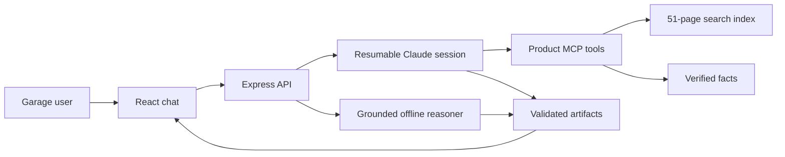

# Arcsmith

Arcsmith is a multimodal technical copilot for the Vulcan OmniPro 220. It searches the supplied product documents, reasons with process-specific tools, and turns answers into exact duty-cycle controls, connection maps, interactive troubleshooting checklists, process recommendations, and cited manual visuals.

This is not a generic PDF chatbot. Technical answers are grounded in a complete local corpus and verified structured records. Claude decides which evidence and tool it needs, but it cannot invent a duty-cycle interpolation or silently switch between MIG, flux-core, TIG, and Stick.

## Run in under two minutes

Requires Node.js 20 or newer.

```bash
npm install
cp .env.example .env
# Add one Anthropic API key to .env
npm run dev
```

Open [http://localhost:5173](http://localhost:5173).

When `ANTHROPIC_API_KEY` is present, Arcsmith uses the Claude Agent SDK with custom product tools and resumable conversation sessions. Without a key, a grounded local reasoner still supports the main evaluation flows and refuses unsupported calculations.

```bash
npm test
npm run typecheck
npm run build
```

## High-value questions

- “What's the duty cycle for MIG welding at 200A on 240V?”
- “What's the TIG duty cycle at 175A on 240V?”
- “What polarity setup do I need for TIG? Which socket does the ground clamp go in?”
- “I'm getting porosity in my gas-shielded MIG weld. What should I check?”
- “I'm getting porosity with self-shielded flux-core.”
- “My feed motor runs, but the wire does not move.”
- “Which process should a beginner use for thin steel indoors?”
- “What settings should I use?” to see correct clarification behavior

## Architecture



### Claude Agent SDK

The live agent has six custom in-process MCP tools:

1. `search_manual` searches every supplied source page and returns page-numbered excerpts and image paths.
2. `read_manual_page` reads a complete page after retrieval.
3. `lookup_duty_cycle` returns exact ratings and explicitly prohibits interpolation.
4. `lookup_connections` returns verified polarity, cable, gas, and safety information by process.
5. `lookup_diagnostic` separates MIG, flux-core, and wire-feed troubleshooting.
6. `compare_processes` exposes the facts in the visual process-selection chart.

The agent has no shell, filesystem mutation, web, or arbitrary code tools. Sessions are resumed by conversation ID so follow-ups such as “What about 120 V?” retain their context.

### Knowledge extraction

The repository contains a pre-generated `knowledge/manual-pages.json` index:

| Source | Indexed pages | Visual treatment |
|---|---:|---|
| Owner’s manual | 48 | Every page pre-rendered |
| Quick-start guide | 2 | Every page pre-rendered |
| Process-selection chart | 1 | Visual facts transcribed and original chart rendered |

The generated corpus is committed, so evaluators do not need Poppler or OCR at runtime. Maintainers can regenerate owner-manual and quick-start text with:

```bash
npm run knowledge:build
```

### Verified fact layer

Duty ratings, current ranges, polarity, connection layouts, wire-feed settings, troubleshooting branches, and process-selection constraints live in `server/product-data.ts`.

The manual publishes only certain duty-cycle points. Arcsmith shows those exact points and refuses to estimate an unlisted current. That matters because a smooth-looking interpolation would have no manufacturer basis.

### Safe multimodal contract

Claude returns a strict JSON-schema response. The server validates it with Zod and canonicalizes safety-critical artifacts against verified records before the frontend sees them.

Supported artifacts:

- Exact duty-cycle control
- Process-specific connection map
- Interactive diagnostic checklist
- Process recommendation card
- Clarification choices
- Clickable manual, quick-start, or selection-chart page

The frontend renders trusted React components. It never executes model-generated JavaScript or HTML.

## Accuracy behavior

- MIG at 200 A on 240 V returns 25%, or 2.5 minutes welding and 7.5 minutes resting.
- TIG at 175 A on 240 V returns 30%, or 3 minutes welding and 7 minutes resting.
- MIG at 100 A on 120 V returns 40%, or 4 minutes welding and 6 minutes resting.
- MIG porosity includes gas bottle, regulator, nozzle, gas selection, contamination, CTWD, travel, and DCEP checks.
- Self-shielded flux-core porosity excludes shielding-gas adjustments and checks DCEN.
- Stick polarity asks for the electrode classification instead of guessing.
- A request for 200 A MIG on 120 V is rejected because the published range ends at 140 A.

## Evaluation

The automated suite covers:

- All manufacturer-rated duty-cycle combinations
- Separation of process, voltage, and amperage
- Refusal to interpolate unlisted ratings
- Out-of-range requests
- Elliptical multi-turn follow-ups
- MIG versus flux-core porosity
- Full wire-feed fault isolation
- Ambiguous settings and clarification
- Full-corpus indexing
- Visual-only chart retrieval

Run:

```bash
npm test
```

## Deployment

```bash
docker build -t arcsmith .
docker run --rm -p 8787:8787 --env-file .env arcsmith
```

The container serves the production frontend and API from port 8787. `.dockerignore` excludes API keys, local dependencies, Git metadata, and source PDFs from the image context.

## Repository map

```text
knowledge/
  manual-pages.json       pre-extracted searchable corpus
scripts/
  build-knowledge.mjs     deterministic extraction script
server/
  agent.ts                Claude Agent SDK and custom MCP tools
  contract.ts             JSON-schema and Zod response validation
  offline-agent.ts        process-aware grounded fallback
  product-data.ts         verified technical records
  retrieval.ts            local ranked retrieval
  index.ts                API and session routing
src/
  main.tsx                chat and artifact renderers
  styles.css              responsive product interface
  types.ts                shared response contract
tests/
  offline-agent.test.ts   technical and adversarial cases
  retrieval.test.ts       corpus and visual retrieval cases
public/
  manual/                 rendered owner-manual pages
  quick-start/            rendered quick-start pages
  reference/              rendered visual selection chart
files/                    original challenge documents
```

## Limitations

- Exact wire speed and voltage pairs are not published in the supplied documents. Arcsmith guides users through the machine’s Auto Weld inputs rather than fabricating numbers.
- Photo-based weld diagnosis and voice are not included.
- The selection chart is a general process guide, not a substitute for the OmniPro’s material-specific on-screen setup.

## Product source

The Vulcan OmniPro 220 documents and imagery were provided by Prox for its Founding Engineer challenge. Arcsmith is a challenge submission, not official Harbor Freight guidance.
